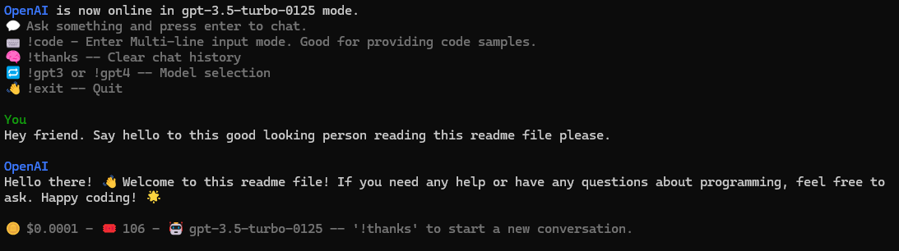
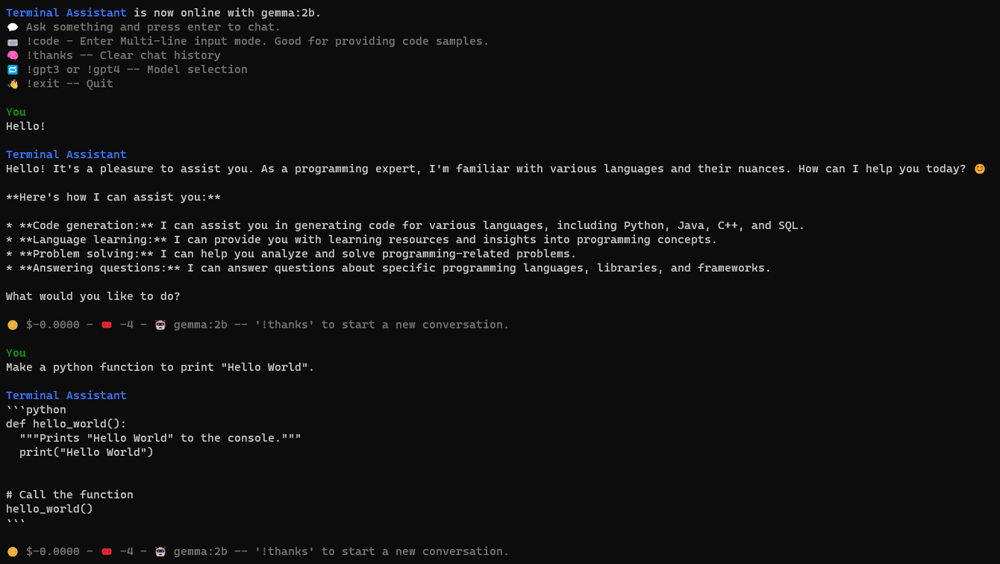

# Terminal Assistant

This is a simple, streaming chatbot that can be powered by either OpenAI or Ollama.
For OpenAI, you can select from GPT-3.5-Turbo or GPT-4-Turbo models from within the app. The estimated cost is displayed at the bottom of every response. To keep costs down, restart conversations when topics change with the `!thanks` command.
For Ollama, you just run the app with `--ollama` argument after setting your model name in .env. The default is "gemma:2b".

## Installation and Setup

1. **Python**: Ensure Python 3.10 or higher is installed on your system.

2. **Dependencies**: Install the required Python packages with the following command:
    ```bash
    pip install openai tiktoken python-dotenv
    ```
    or
    ```bash
    pip install -r requirements.txt
    ```

3. **API Key**: Set your OpenAI API key, Ollama Model, and optionally the Assistant Name in `.env` file like this:
    ```bash
    OLLAMA_MODEL=gemma:2b
    OPEN_AI_KEY=sk-demo
    ASSISTANT_NAME="Terminal Assistant"
    ```

4. **Identity**: Modify the 'identity' variable within the code to change the bot's identity if you wish.

5. **Run the Chatbot**: Start the chatbot with the following command for OpenAI by default:
    ```bash
    python terminal-assistant.py
    ```
    and use the following command for Ollama:
    ```sh
    python terminal-assistant.py --ollama
    ```

> **Note**: This bot uses the newest OpenAI python package and therefore the newer API call. If it's not working for you, you may need to update the package with `pip install --upgrade openai`.

## Usage

- 💬 **Chat**: Simply type your message and press enter to chat. The conversation history is maintained until you wipe it with `!thanks`.

- ⌨️ **Multi-line Input**: Use `!code` to enter multi-line input mode. This is useful for providing code samples.

- 🧠 **Clear History**: Use `!thanks` to clear the chat history.

- 🔁 **Model Selection**: Use `!gpt3` or `!gpt4` to select the model.

- 👋 **Quit**: Use `!exit` to quit the application.

## Screenshots

#### OpenAI

#### Ollama
